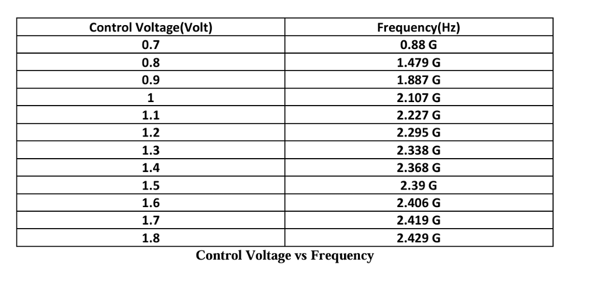
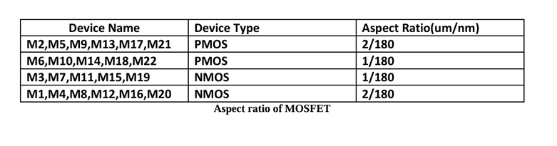
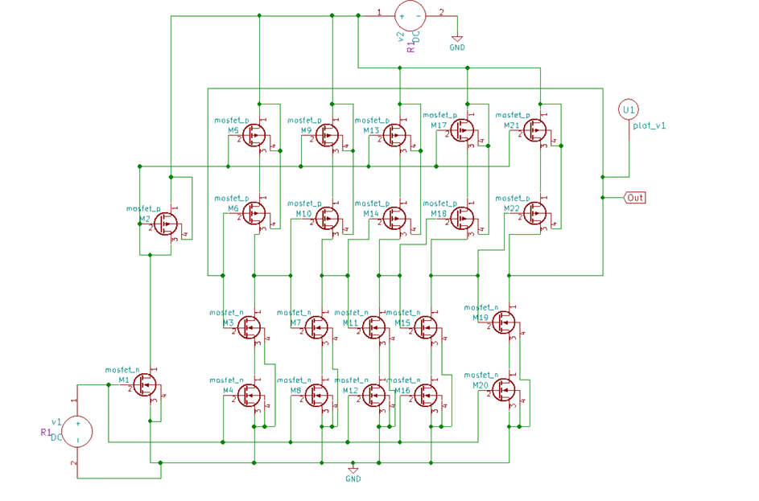

# Current Starved VCO in eSim
## Abstract
This project focuses on the design and simulation of a Current-Starved Voltage Controlled Oscillator (VCO) using the open-source eSim platform. The circuit employs a CMOS-based ring oscillator topology, where additional current-starving transistors are used to regulate the bias current and control the oscillation frequency through an applied control voltage. By varying this control voltage, the output frequency of the oscillator can be tuned across a wide range. The simulation results demonstrate a clear increase in oscillation frequency with higher control voltage levels, validating the voltage-controlled behavior of the circuit. The designed VCO exhibits stable operation with low power consumption, making it suitable for integration in phase-locked loops (PLLs), frequency synthesizers, and wireless communication systems.

## Reference Circuit Details
The reference design for the Current-Starved Voltage Controlled Oscillator (VCO) is based on a five-stage CMOS ring oscillator topology. Each inverter stage consists of a PMOS–NMOS pair acting as a delay element. To control the current flowing through each inverter stage, additional PMOS and NMOS transistors are connected in series with the supply and ground terminals respectively. These transistors act as current-limiting devices, and the control voltage applied to their gates determines the amount of current available to charge and discharge the load capacitances at each stage.


## Reference Circuit Diagram


## Tools Used:
• esim:  esim design environment is a modern solution for full-custom analog, custom digital, and mixed-signal IC design. esim provides design entry, simulation management and analysis, and custom layout editing features. This tool was used to design the circuit on a transistor level.

• IHP PDK: The IHP Process Design Kit (PDK) provides a comprehensive set of models, design rules, and libraries for simulating and fabricating CMOS and BiCMOS circuits. It enables accurate analog, digital, and mixed-signal circuit design, supporting advanced nodes like SG13G2 (130 nm). The PDK ensures precise device behavior representation, making it ideal for research and development in high-performance RF, analog, and low-power applications.


## Simulation in esim
### Circuit in eSim

### For input V=1volt

### For input V=0.7volt

### For input V=1.5volt


## Netlist
```
* c:\users\lenovo\esim-workspace\oscillator1\oscillator1.cir

* Load OSDI model interface and PDK model files


.lib /home/krish/IHP-Open-PDK/ihp-sg13g2/libs.tech/ngspice/models/cornerMOSlv.lib mos_tt
.control
pre_osdi /home/krish/IHP-Open-PDK/ihp-sg13g2/libs.tech/ngspice/osdi/psp103_nqs.osdi
.endc
* Transistor-level netlist
xm5 net-_m10-pad4_ net-_m1-pad1_ net-_m5-pad3_ net-_m10-pad4_ sg13_lv_pmos W=2u L=180n M=1
xm9 net-_m10-pad4_ net-_m1-pad1_ net-_m10-pad1_ net-_m10-pad4_ sg13_lv_pmos W=2u L=180n M=1
xm13 net-_m10-pad4_ net-_m1-pad1_ net-_m13-pad3_ net-_m10-pad4_ sg13_lv_pmos W=2u L=180n M=1
xm17 net-_m10-pad4_ net-_m1-pad1_ net-_m17-pad3_ net-_m10-pad4_ sg13_lv_pmos W=2u L=180n M=1
xm21 net-_m10-pad4_ net-_m1-pad1_ net-_m21-pad3_ net-_m10-pad4_ sg13_lv_pmos W=2u L=180n M=1
xm6 net-_m5-pad3_ out net-_m10-pad2_ net-_m10-pad4_ sg13_lv_pmos W=1u L=180n M=1
xm10 net-_m10-pad1_ net-_m10-pad2_ net-_m10-pad3_ net-_m10-pad4_ sg13_lv_pmos W=1u L=180n M=1
xm14 net-_m13-pad3_ net-_m10-pad3_ net-_m11-pad1_ net-_m10-pad4_ sg13_lv_pmos W=1u L=180n M=1
xm18 net-_m17-pad3_ net-_m11-pad1_ net-_m15-pad1_ net-_m10-pad4_ sg13_lv_pmos W=1u L=180n M=1
xm22 net-_m21-pad3_ net-_m15-pad1_ out net-_m10-pad4_ sg13_lv_pmos W=1u L=180n M=1
xm2 net-_m10-pad4_ net-_m1-pad1_ net-_m1-pad1_ net-_m10-pad4_ sg13_lv_pmos W=2u L=180n M=1
xm3 net-_m10-pad2_ out net-_m3-pad3_ gnd sg13_lv_nmos W=1u L=180n M=1
xm7 net-_m10-pad3_ net-_m10-pad2_ net-_m7-pad3_ gnd sg13_lv_nmos W=1u L=180n M=1
xm11 net-_m11-pad1_ net-_m10-pad3_ net-_m11-pad3_ gnd sg13_lv_nmos W=1u L=180n M=1
xm15 net-_m15-pad1_ net-_m11-pad1_ net-_m15-pad3_ gnd sg13_lv_nmos W=1u L=180n M=1
xm19 out net-_m15-pad1_ net-_m19-pad3_ gnd sg13_lv_nmos W=1u L=180n M=1
xm4 net-_m3-pad3_ net-_m1-pad2_ gnd gnd sg13_lv_nmos W=2u L=180n M=1
xm8 net-_m7-pad3_ net-_m1-pad2_ gnd gnd sg13_lv_nmos W=2u L=180n M=1
xm12 net-_m11-pad3_ net-_m1-pad2_ gnd gnd sg13_lv_nmos W=2u L=180n M=1
xm16 net-_m15-pad3_ net-_m1-pad2_ gnd gnd sg13_lv_nmos W=2u L=180n M=1
xm20 net-_m19-pad3_ net-_m1-pad2_ gnd gnd sg13_lv_nmos W=2u L=180n M=1
xm1 net-_m1-pad1_ net-_m1-pad2_ gnd gnd sg13_lv_nmos W=2u L=180n M=1

* Power supplies
v1 net-_m1-pad2_ gnd  dc 1
v2 net-_m10-pad4_ gnd  dc 1.8

* Initial condition to start oscillation
.ic v(out)=0.1

.tran 1e-12 20e-9

* Control Statements 
.control
run
print allv > plot_data_v.txt
print alli > plot_data_i.txt
plot v(out)
.endc
.end

```
## Conclusion
In this project, a Current-Starved Voltage Controlled Os
cillator (VCO) was successfully designed and simulated using
 eSim. The output frequency was observed to vary with changes
 in the input control voltage, confirming the voltage-controlled
 nature of the circuit. As the control voltage increased, the
 oscillation frequency also increased due to higher current in
 the delay stages, resulting in faster charging and discharging
 of capacitors. The circuit achieved stable oscillations with
 efficient power consumption from the DC supply. The results  demonstrate that the output frequency of the current-starved
 VCO can be tuned by adjusting the input voltage, making it
 suitable for applications such as phase-locked loops (PLLs)
 and frequency synthesizers in communication systems.


## Acknowledgement
1. FOSSEE,IIT Bombay

## References
1. https://www.irjet.net/archives/V5/i3/IRJET-V5I3191.pdf
