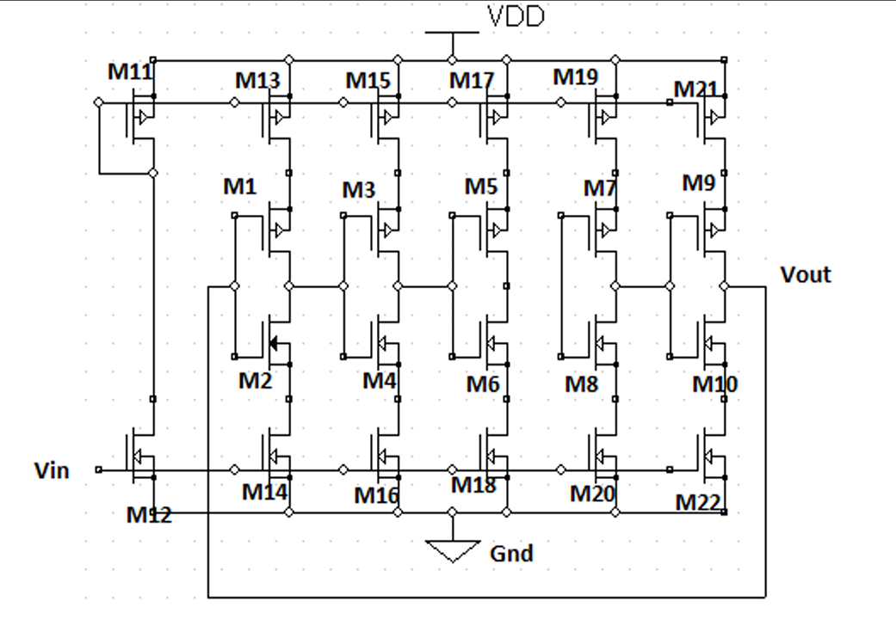

# Current Starved VCO in eSim
## Abstract
This project focuses on the design and simulation of a Current-Starved Voltage Controlled Oscillator (VCO) using the open-source eSim platform. The circuit employs a CMOS-based ring oscillator topology, where additional current-starving transistors are used to regulate the bias current and control the oscillation frequency through an applied control voltage. By varying this control voltage, the output frequency of the oscillator can be tuned across a wide range. The simulation results demonstrate a clear increase in oscillation frequency with higher control voltage levels, validating the voltage-controlled behavior of the circuit. The designed VCO exhibits stable operation with low power consumption, making it suitable for integration in phase-locked loops (PLLs), frequency synthesizers, and wireless communication systems.

## Reference Circuit Details
The reference design for the Current-Starved Voltage Controlled Oscillator (VCO) is based on a five-stage CMOS ring oscillator topology. Each inverter stage consists of a PMOS–NMOS pair acting as a delay element. To control the current flowing through each inverter stage, additional PMOS and NMOS transistors are connected in series with the supply and ground terminals respectively. These transistors act as current-limiting devices, and the control voltage applied to their gates determines the amount of current available to charge and discharge the load capacitances at each stage.
## Reference Circuit Diagram

